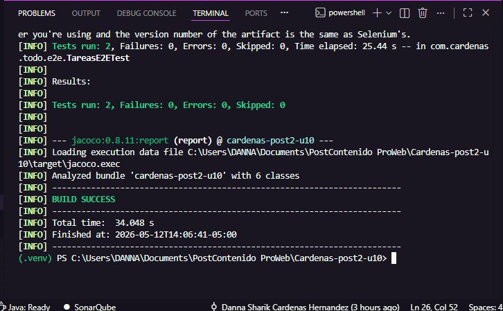
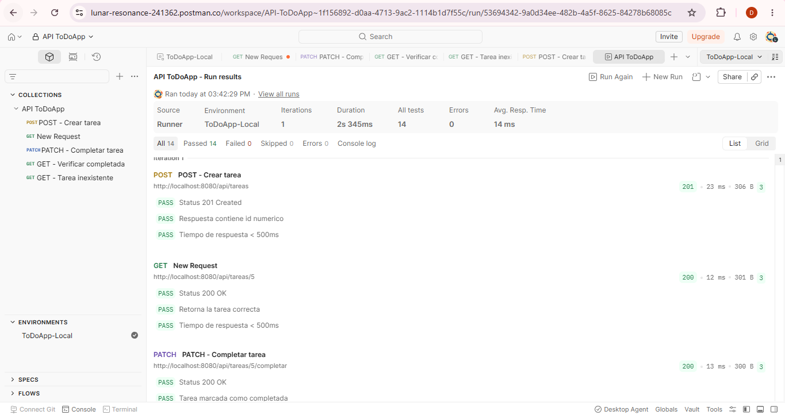
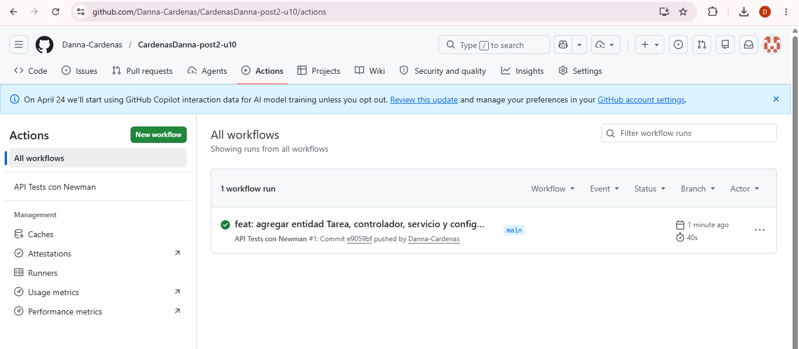

# Post Contenido 2 - Unidad 10

Pruebas E2E con Selenium, Postman y Newman.

## Requisitos
- Java 17+
- Maven 3.9+
- Google Chrome estable
- Postman Desktop v10+ o Postman Web
- Node.js 18+ (para Newman)
- GitHub Actions habilitado en el repo

## Ejecucion de la app
```bash
mvn spring-boot:run
```

## Selenium (Checkpoint 1)
Los tests E2E estan en `src/test/java/com/cardenas/todo/e2e`.

Ejecutar tests E2E:
```bash
mvn -Dtest=TareasE2ETest test
```

## Postman (Checkpoint 2)
Archivos en la carpeta `postman/`:
- `ColeccionToDo.json`
- `env-local.json`
- `env-ci.json`

Importa la coleccion y el entorno `env-local.json`, luego ejecuta el Runner (5 requests en orden, 0 failures).

## Newman (local)
Con la app corriendo:
```bash
newman run postman/ColeccionToDo.json --environment postman/env-local.json
```

## GitHub Actions (Checkpoint 3)
Workflow: `.github/workflows/api-tests.yml`

## Evidencias

### Evidencia 1 - Tests Selenium en verde


### Evidencia 2 - Postman Runner 0 failures


### Evidencia 3 - GitHub Actions check verde

